# Awesome Cloud PowerShell Automation ⚡

  
  
  
  
  
  

---

**Curated List of Cloud Infrastructure SaaS Products, Multi-Platform Cmdlets & Open-Source PowerShell Automation Projects** 🚀  

*Focused on Cloud Infrastructure Management, Hybrid Cloud Automation & Enterprise PowerShell Utilities.*

**Last updated: October 2026** 📅

---

This repository tracks notable **cloud provider modules**, enterprise SaaS tools, and **open-source PowerShell projects** for **Cloud PowerShell Automation**. These tools enable DevOps engineers, system administrators, and cloud architects to programmatically manage cloud infrastructure, virtual machines, storage systems, and enterprise back-ups directly from the PowerShell scripting environment.

**Key highlights & top tools** include Azure PowerShell (Az), AWS Tools for PowerShell, VMware PowerCLI, Pure Storage SDK, NetApp Toolkit, Rubrik SDK, Veeam PowerShell, Cisco UCS PowerTool, Nutanix Cmdlets, and community Proxmox VE modules.

---

## 📖 Table of Contents

- [📊 SaaS Products & Cloud Provider Modules](#-saas-products--cloud-provider-modules)
- [🔓 Open-Source GitHub Projects](#-open-source-github-projects)
- [🤝 How to Contribute](#-how-to-contribute)
- [💖 Support & Sponsorship](#-support--sponsorship)
- [📈 Star History](#-star-history)
- [⚠️ Disclaimer](#-disclaimer)

---

## 📊 SaaS Products & Cloud Provider Modules

> **📊 Market Context & Structure**: The cloud infrastructure management market is estimated at **~$18 Billion in 2026**. The sector is **highly concentrated** around major infrastructure vendors (Microsoft, Amazon, Broadcom/VMware, Cisco, NetApp) who provide free PowerShell cmdlet modules as value-added interfaces to drive core platform consumption. The market exhibits a "winner-takes-most" structure for hyperscaler management, while enterprise storage and backup automation remain moderately fragmented across specialized infrastructure leaders. Note that **Google Cloud Tools for PowerShell was officially deprecated in January 2026**.

*Note: All SaaS modules and SDKs below are free value-add tools; pricing reflects the entry-level commercial platform/subscription tier, and company size is listed by market capitalization or annual revenue, sorted in descending order.* 💰

| Platform / Product | Description | Pricing (Starting Tier) | Free Tier Limits | Enterprise Size (Rev / Cap) |
|---|---|---|---|---|
| **[AWS Tools for PowerShell](https://github.com/aws/aws-tools-for-powershell)** ⚡ | Official modular PowerShell cmdlets (`AWS.Tools`) for managing Amazon Web Services infrastructure. | **$0.0001/sec** (EC2 t4g.nano starts ~$0.0042/hr; Module is 100% Free) | **AWS Free Tier**: $100 sign-up credits + 750 hrs/mo EC2 t2.micro / t3.micro for 12 months + 5GB S3 storage forever. | **~$3.10 Trillion Market Cap** (Amazon) |
| **[Azure PowerShell (Az)](https://github.com/Azure/azure-powershell)** ☁️ | Official Microsoft cmdlets for developing, deploying, and managing Azure cloud resources. | **$0.005/hr** (Azure B1ls VM starts ~$3.80/mo; Module is 100% Free) | **Azure Free Account**: $200 credit for 30 days + 55+ always-free services (e.g. 1M Azure Functions invocations/mo) + 12 months free popular services. | **~$3.05 Trillion Market Cap** (Microsoft) |
| **[Google Cloud Tools for PowerShell](https://github.com/GoogleCloudPlatform/google-cloud-powershell)** 🚨 | *(Deprecated Jan 2026)* PowerShell cmdlets for GCP resource management. | **$0.006/hr** (e2-micro instance starts ~$7.11/mo; Module is 100% Free) | **GCP Free Tier**: $300 credit for 90 days + 1 free e2-micro instance/mo + 5GB Cloud Storage. *(Deprecated: migrate to gcloud CLI)*. | **~$2.45 Trillion Market Cap** (Alphabet) |
| **[Cisco UCS PowerTool](https://github.com/CiscoUcs/PowerTool)** 🔌 | Automation cmdlets for Cisco UCS servers, HyperFlex, and Cisco Intersight cloud management. | **$120/yr** (Cisco Intersight Essentials tier per server; Cmdlets are Free) | **Cisco Intersight Base**: Free forever tier for basic hardware monitoring & inventory; 90-day full feature trial. | **~$260 Billion Market Cap** (Cisco Systems) |
| **[VMware PowerCLI](https://developer.vmware.com/powercli)** 🖥️ | The enterprise standard PowerShell module for automating VMware vSphere, NSX, and Cloud infrastructure. | **$50/core/yr** (vSphere Standard subscription starting tier; PowerCLI is Free) | **VMware Evaluation**: 60-day full feature free trial for vSphere & ESXi Hypervisor evaluation. | **~$170 Billion Market Cap** (Broadcom) |
| **[NetApp PowerShell Toolkit](https://github.com/NetApp/netapp-powershell-toolkit)** 💾 | PowerShell cmdlets (Data ONTAP) for managing NetApp storage systems and Cloud Volumes ONTAP. | **$0.10/GB/mo** (Cloud Volumes ONTAP pay-as-you-go; Toolkit is Free) | **NetApp Cloud Volumes Trial**: 30-day free trial on AWS/Azure/GCP (up to 500GB allocation). | **~$23 Billion Market Cap** (NetApp) |
| **[Rubrik PowerShell Module](https://github.com/rubrikinc/rubrik-sdk-for-powershell)** 🛡️ | PowerShell SDK for automating Rubrik Zero Trust Data Security, cloud backup, and recovery. | **~$2,500/yr** (Rubrik Cloud Vault subscription entry tier; Module is Free) | **Rubrik Enterprise Trial**: 30-day full-featured virtual appliance evaluation on request. | **~$11 Billion Market Cap** (Rubrik Inc.) |
| **[Pure Storage PowerShell SDK](https://github.com/PureStorage-OpenConnect/powershell-sdk)** ⚡ | PowerShell module for configuring and managing Pure Storage FlashArray & FlashBlade arrays. | **~$1,500/mo** (Pure as-a-Service subscription entry; SDK is Free) | **Pure Test Drive**: 45-day hosted virtual lab evaluation with full API/SDK access. | **~$10 Billion Market Cap** (Pure Storage) |
| **[Nutanix Cmdlets](https://github.com/nutanix/powershell)** 🌀 | PowerShell automation cmdlets for Nutanix AHV hypervisor, Prism Central, and Calm cloud management. | **~$150/core/yr** (Nutanix NCI starter licensing; Cmdlets are Free) | **Nutanix Community Edition**: Free forever non-production license for homelabs/testing (up to 4 nodes). | **~$9.5 Billion Market Cap** (Nutanix) |
| **[Veeam PowerShell](https://github.com/VeeamHub/powershell)** 📦 | Automate Veeam Backup & Replication, Veeam ONE monitoring, and cloud backup workflows. | **$180/yr** (Veeam Universal License 10-pack starting rate; Module is Free) | **Veeam Community Edition**: Free forever full features for up to 10 workloads/VMs; 30-day enterprise trial. | **~$3.0 Billion Valuation** (Veeam / Insight Partners) |

---

## 🔓 Open-Source GitHub Projects

> Community-maintained open-source PowerShell projects, infrastructure modules, and cloud utilities. Sorted by GitHub stars (descending). ⭐

| Repo | Description | Stars |
|---|---|---|
| **[Azure PowerShell (Az)](https://github.com/Azure/azure-powershell)** ☁️ | Microsoft's official Azure PowerShell module. Cross-platform cmdlets for Azure resource management and Cloud Shell integration. Apache-2.0. |  |
| **[DSC Community Resources](https://github.com/dsccommunity)** 🛠️ | Suite of community-maintained Desired State Configuration (DSC) resources for enterprise Windows & Cloud infrastructure (`HyperVDsc`, `SecurityPolicyDsc`, `WebAdministrationDsc`). MIT. |  |
| **[AzOps](https://github.com/Azure/AzOps)** 🚀 | Azure Landing Zones DevOps framework using PowerShell to push/pull ARM templates & Bicep resources. MIT. |  |
| **[Corsinvest Proxmox VE API](https://github.com/Corsinvest/cv4pve-api-powershell)** 🖥️ | Proxmox VE PowerShell module enabling PowerCLI-like API automation, VM management, and task monitoring. GPL-3.0. |  |
| **[AWS Tools for PowerShell](https://github.com/aws/aws-tools-for-powershell)** ⚡ | AWS official PowerShell repository containing modular cmdlets for 200+ AWS cloud services. Apache-2.0. |  |
| **[Azure Stack Hub Tools](https://github.com/Azure/AzureStack-Tools)** 🏢 | Official PowerShell modules for Azure Stack Hub admin, capacity management, VPN setup, and ARM validator. MIT. |  |
| **[EldoBam Proxmox PVE Module](https://github.com/EldoBam/pve-powershell-module)** 🌐 | Lightweight PowerShell module for Proxmox VE hypervisor REST API interaction and cluster administration. MIT. |  |
| **[AWS.Tools Parallel Installer (atp)](https://github.com/HP-85/atp)** ⏱️ | High-speed multi-platform installer script for AWS.Tools. Extracts and installs all AWS modules in ~7 seconds. MIT. |  |

---

## 🤝 How to Contribute

Contributions are welcome! Help us expand this collection of cloud PowerShell automation tools: 🌟

1. 🍴 **Fork** the repository.
2. 📝 **Add/edit** entries in `README.md` following the exact table structure.
3. 🔍 Ensure pricing details, free tier quotas, and star badges are accurate.
4. 📥 Submit a **Pull Request** with a clear title and context.

---

## 💖 Support & Sponsorship

If you find this repository helpful for your cloud operations and PowerShell workflows, please consider supporting the project! ☕

- ⭐ **Star this repo** on GitHub to increase visibility.
- 🔀 **Fork & Share** it with your fellow DevOps and PowerShell automation engineers.
- 💖 **Sponsor the Maintainer**: [GitHub Sponsor Dashboard](https://github.com/sponsors/ishandutta2007)

---

## 📈 Star History

---

## ⚠️ Disclaimer

- This is a **community-curated list** provided for educational and informational purposes only.
- Cloud PowerShell modules interact directly with enterprise cloud infrastructure. Always follow security best practices, least-privilege RBAC policies, and credential vaulting (e.g. `SecretManagement` module).
- **Google Cloud Notice**: *Google Cloud Tools for PowerShell reached End-of-Life (EOL) in January 2026*. Migrate new automation to Google Cloud CLI (`gcloud`) or REST APIs.
- **Pricing & Quotas**: All listed prices, valuations, and free tier limits are derived from published enterprise rate cards as of late 2026 and are subject to provider modifications.

---

  <b>Curated with ❤️ for Cloud Administrators, DevOps Engineers, and PowerShell Automation Enthusiasts worldwide.</b>

